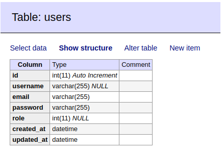

# Check24 training day

## Technical assignment
Implement blog system described in the separate document
- no MVC framework
- Using Composer is preferrable
- Quality over quantity
- ...

## How application looks like

## Application technical details

- PHP 7
- Docker
- Mysql

## How to use application   
docker-compose up
docker-compose exec check composer install

## Main application links
- http://0.0.0.0:8000/ - main application
- http://0.0.0.0:8080/ - adminer

## DB (and Adminer credentials)
- DB_SERVER=db-mysql
- DB_USERNAME=root
- DB_PASSWORD=root
- DB_NAME=check

## DB structure

## Contributors
@belushkin

## License
MIT License